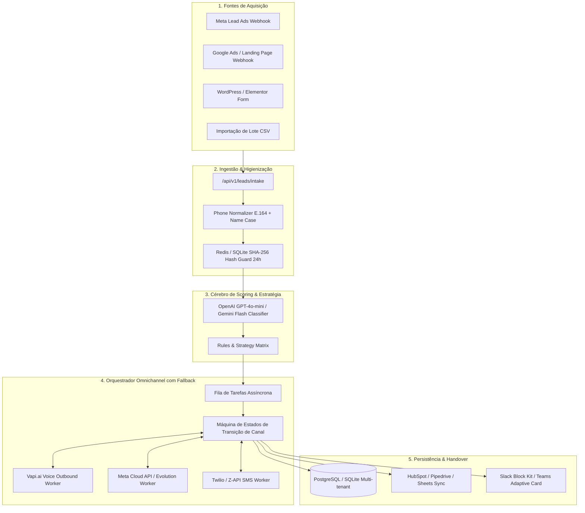
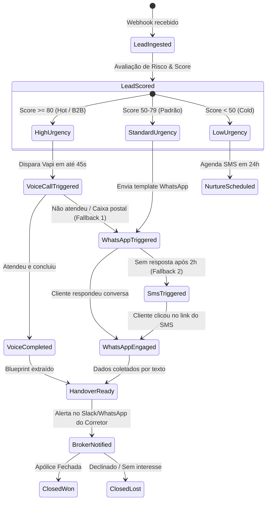

# 🏛️ Arquitetura Técnica do Insurance Lead Engine

Este documento define a arquitetura técnica, modelo de dados, contratos de API e a máquina de estados de fallback em cascata para o **Insurance Lead Engine**.

---

## 1. Visão Arquitetural de Componentes



---

## 2. Máquina de Estados: Cascading Fallback Engine

A grande inovação do produto é a **continuidade sem atrito**. O lead nunca é abandonado caso não atenda ou demore para responder.



---

## 3. Contrato de Ingestão de Leads (`/api/v1/leads/intake`)

### Request Payload (JSON)
```json
{
  "source": "facebook_lead_ads",
  "campaign": "seguro_auto_prime_sp",
  "name": "Marcelo Albuquerque de Castro",
  "phone": "(11) 98765-4321",
  "email": "marcelo.albuquerque@empresa.com",
  "city": "São Paulo",
  "state": "SP",
  "insuranceType": "auto",
  "notes": "Tenho uma BMW X3 2023, seguro atual vence em 10 dias na Porto.",
  "urgency": "alta",
  "preferredContact": "qualquer"
}
```

### Resposta Imediata do Webhook (HTTP 200 OK em < 200ms)
```json
{
  "success": true,
  "leadId": "lead_99812f8a",
  "status": "queued_for_processing",
  "estimatedActionTimeSeconds": 30
}
```

---

## 4. O Blueprint de Qualificação (Estrutura de Saída para o Corretor)

Ao final da interação (seja por voz ou WhatsApp), o sistema compila o seguinte objeto estruturado no banco e envia para o corretor:

```json
{
  "leadId": "lead_99812f8a",
  "score": 92,
  "priority": "HOT_LEAD",
  "qualificationSummary": {
    "segurado": "Marcelo Albuquerque de Castro",
    "telefone": "+5511987654321",
    "ramo": "Seguro Automóvel",
    "veiculo": "BMW X3 xDrive30e M Sport 2023",
    "placaOuChassi": "Informado que enviará pelo WhatsApp",
    "seguradoraAtual": "Porto Seguro (vence em 10 dias)",
    "uso": "Particular / Residência para Escritório",
    "garagem": "Sim (casa e trabalho)",
    "condutorPrincipal": "Marcelo (42 anos, casado)",
    "principaisDores": "Achou a renovação da seguradora atual muito cara; deseja coberturas adicionais para vidros blindados.",
    "melhorHorarioContato": "Disponível agora à tarde"
  },
  "recommendedAction": "Ligar imediatamente para apresentar comparativo Porto x Bradesco x Allianz com foco em vidros/franquia reduzida.",
  "links": {
    "directWhatsApp": "https://wa.me/5511987654321",
    "audioRecordingUrl": "https://api.vapi.ai/recordings/rec_98812.mp3",
    "fullTranscript": "https://app.leadengine.com.br/leads/lead_99812f8a/transcript"
  }
}
```

---

## 5. Modelo de Dados (Prisma / SQL)

```prisma
model Lead {
  id              String         @id @default(cuid())
  organizationId  String
  nome            String
  telefone        String
  email           String?
  origem          String         // meta_ads, google_ads, site, csv
  ramoDesejado    String         // auto, saude, vida, empresarial, etc.
  score           Int            @default(0)
  prioridade      String         @default("cold") // hot, warm, cold
  status          String         @default("recebido") // recebido, em_contato, qualificado, desqualificado, fechado
  canalAtual      String?        // vapi, whatsapp, sms, corretor
  resumoIa        String?
  dadosColetados  String?        // JSON estruturado do Blueprint
  tentativasVoz   Int            @default(0)
  createdAt       DateTime       @default(now())
  updatedAt       DateTime       @updatedAt

  interacoes      LeadInteracao[]
  
  @@index([organizationId, telefone])
  @@index([organizationId, score])
  @@index([organizationId, status])
}

model LeadInteracao {
  id          String   @id @default(cuid())
  leadId      String
  canal       String   // voz_vapi, whatsapp_aria, sms_twilio, humano_corretor
  direcao     String   // inbound, outbound
  conteudo    String?  // transcrição ou mensagem
  audioUrl    String?
  duracaoSeg  Int?
  createdAt   DateTime @default(now())

  lead        Lead     @relation(fields: [leadId], references: [id], onDelete: Cascade)
  
  @@index([leadId])
}
```
