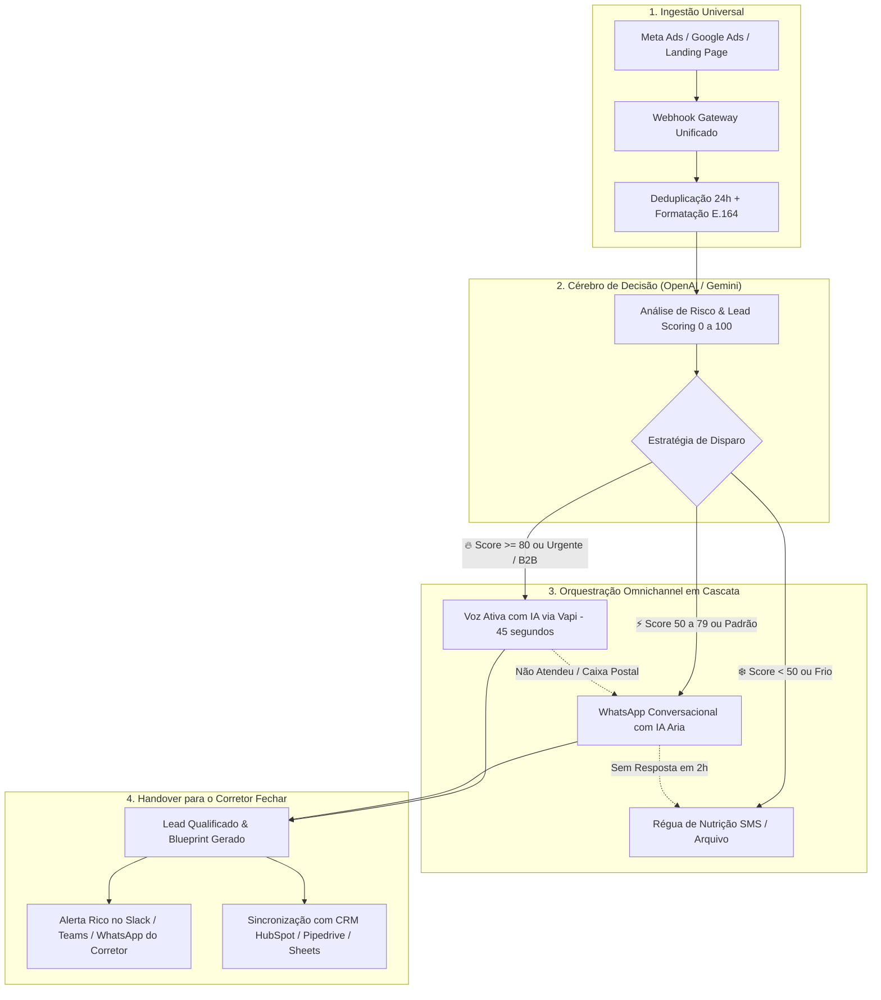

# ⚡ Insurance Lead Engine — Plataforma Omnichannel de Speed-to-Lead com IA para Corretoras

> **A máquina unificada de aquisição e conversão de leads para o mercado segurador: transforma cotações de tráfego pago em reuniões e apólices fechadas em menos de 60 segundos através de Voz Ativa com IA, WhatsApp Conversacional e Roteamento Inteligente.**

---

## 🎯 Por que este produto existe?

No mercado de seguros (Auto, Saúde, Vida, Residencial e Empresarial), **90% das cotações vindas de anúncios esfriam nas primeiras duas horas**. O corretor tradicional demora horas (ou dias) para abrir o lead, tentar ligar e mandar mensagem. Quando entra em contato, o cliente já fechou com o concorrente ou não atende mais.

O **Insurance Lead Engine** unifica em um único ecossistema os motores que antes estavam dispersos:
1. **Roteador e Scoring com IA** (antigo `insurance-quote-ai-router`)
2. **Atendimento de Voz Ativo com IA em 45 segundos** (antigo `vapi-gpt4-airtable-...`)
3. **Assistente de WhatsApp Conversacional com Memória** (antigo `whatsapp-ai-insurance-...`)
4. **Régua de Fallback e Nutrição SMS** (antigo `aloware-insurance-...`)

---

## 🧠 Como o Produto Funciona (Visão Geral)



---

## 💎 Diferenciais Competitivos

* **Tempo de Resposta Médio < 45 segundos:** Enquanto a média do mercado é de 4 a 12 horas, o sistema liga para o lead enquanto ele ainda está navegando na página do anúncio.
* **Cascading Fallback (Sem Perda de Lead):** Se o cliente não atender a ligação de voz, instantaneamente o WhatsApp dele apita com uma mensagem contextualizada (*"Olá Carlos, tentei te ligar sobre o seguro da sua Hilux, mas caiu na caixa postal..."*).
* **Compliance e Trava SUSEP:** A IA qualifica interesse, perfil de uso e coberturas, mas **nunca inventa valores de prêmio ou franquia**. O preço final é prerrogativa exclusiva do corretor humano.
* **Blueprint Comercial Mastigado:** O corretor não precisa ouvir 10 minutos de áudio; ele recebe um resumo executivo com os dados essenciais para emitir o cálculo no cotador da seguradora.

---

## 📁 Estrutura da Documentação Técnica do Projeto

| Documento | Conteúdo |
| :--- | :--- |
| **[`ARCHITECTURE.md`](./ARCHITECTURE.md)** | Arquitetura técnica completa, fluxo de dados, eventos e contratos de API/Webhook. |
| **[`WORKFLOWS_INTEGRATION.md`](./WORKFLOWS_INTEGRATION.md)** | Mapeamento de unificação dos nós do n8n / serviços Node.js sem sobreposição. |
| **[`PROMPTS_AND_AGENTS.md`](./PROMPTS_AND_AGENTS.md)** | Engenharia de prompts para o Agente de Voz, Assistente WhatsApp e Scorer de Risco. |
| **[`ROADMAP_IMPLEMENTATION.md`](./ROADMAP_IMPLEMENTATION.md)** | Plano de execução prático de construção e lançamento em 4 fases. |
| **[`docs/`](./docs/)** | **Cadernos Técnicos do Sistema Unificado:** `01-PRD.md` a `10-DESIGN_SYSTEM.md` e `CLAUDE.md`. |

---

## 🛠️ Comandos de Desenvolvimento & Testes

```bash
# Instalar dependências
npm install

# Rodar banco de dados e migrações
npx prisma db push
npm run prisma:seed

# Rodar suíte de testes unitários com Vitest (19 testes de regressão)
npm test

# Executar verificação estática de tipos TypeScript
npx tsc --noEmit

# Iniciar servidor de desenvolvimento
npm run dev

# Compilar para produção
npm run build
```

---

## 💬 Live Chat Cockpit & Speed-to-Lead Inbox (`/dashboard/chat`)

* **Central Omnicanal Integrada:** Permite ao corretor acompanhar em tempo real todas as interações de WhatsApp e chamadas de voz ativa geradas pelo Vapi.
* **Handover Humano:** Botão *"Assumir Atendimento"* transfere o controle para o corretor e coloca a IA em modo espectador.
* **Player de Áudio:** Execução de gravações de voz com transcrição vinculada ao lead.
* **Proteção SUSEP Automática:** O motor `src/lib/compliance.ts` barra automaticamente qualquer tentativa de automação de prometer valores arbitrários de prêmio ou franquia antes do cálculo oficial do corretor.

---

## 💰 Modelo de Negócio & Precificação Sugerida

Para corretoras com tráfego pago ativo (que investem de R$ 1.500 a R$ 15.000/mês em anúncios):

1. **Taxa de Implantação / Setup:** R$ 2.500 a R$ 5.000 (integração dos canais, formulários, WhatsApp Oficial e treinamento da IA com os ramos da corretora).
2. **Assinatura Mensal (SaaS / Fee Operacional):**
   - **Plano Pro (até 300 leads/mês):** R$ 590/mês.
   - **Plano Scale (até 1.000 leads/mês com Voz Ativa):** R$ 1.190/mês.
   - **Plano Enterprise (Multifilial + CRM dedicado):** R$ 2.490/mês.
3. **Custo Operacional de IA:** Repassado ao cliente via créditos de consumo ou embutido na margem (custo médio por lead qualificado completo com voz e WhatsApp gira em torno de R$ 0,35 a R$ 0,80).
