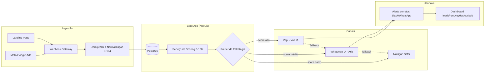

# ARCHITECTURE.md — Insurance Lead Engine

## 1. Stack decidida
- **Frontend/App**: Next.js 16 (App Router), Tailwind CSS
- **ORM**: Prisma
- **Banco**: SQLite em dev, Postgres em produção (Prisma facilita a migração — **decidir Postgres gerenciado desde já**: Neon, Supabase ou RDS, para não migrar dado de produção depois)
- **Fila/orquestração de eventos**: nativa, sem n8n (decisão fechada — ver ADR-001). Escolher entre BullMQ+Redis (deploy em servidor persistente), pg-boss (fila sobre o próprio Postgres, sem infra extra) ou Upstash QStash + Vercel Cron (deploy serverless). **Definir qual das três antes da Fase 2 do roadmap.**
- **IA**: OpenAI/Gemini para scoring e agentes conversacionais; Vapi para voz ativa
- **Canais**: WhatsApp Business API (oficial), SMS (provedor a definir: Twilio/Zenvia), Meta Ads/Google Ads webhooks

## 2. Diagrama de componentes

## 3. Módulos e suas responsabilidades
| Módulo | Rota | Responsabilidade | Depende de |
|---|---|---|---|
| Esteira de leads | `/dashboard/leads` | Listar, priorizar, permitir contato rápido | Serviço de scoring, canais |
| Radar de renovações | `/dashboard/renovacoes` | Calcular decaimento temporal e risco de churn | Dados de carteira importada |
| Cockpit de cotação | `/dashboard/cotacao-cockpit` | Matriz comparativa entre 8 seguradoras | Dados de simulador |
| Simulador | `/dashboard/simulador` | Cálculo de prêmio/comissão (regra de negócio, não IA) | Tabelas de comissão por seguradora |
| Importação | `/dashboard/importar` | Ingestão CSV/XLSX | Parser + validação de schema |
| Templates | `/dashboard/templates` | Réguas de mensagem | Canais (WhatsApp/SMS) |
| Configurações | `/dashboard/configuracoes` | Parâmetros da corretora e credenciais de integração | — |

## 4. Decisões de arquitetura pendentes (ADRs a fechar antes de codar)

### ADR-001: Orquestração de cascata — FECHADO: tudo nativo, sem n8n
Decisão: toda a orquestração (roteamento de score, cascata voz→WhatsApp→SMS, fallback por tempo, dead-letter) vive dentro do próprio código Next.js/Node, versionada e testável. Nenhum fluxo crítico depende de ferramenta low-code externa.

Sub-decisão pendente — qual mecanismo de fila usar (escolher 1 antes da Fase 2):
| Opção | Quando faz sentido | Trade-off |
|---|---|---|
| BullMQ + Redis | Deploy em servidor/container persistente | Precisa provisionar e manter Redis |
| pg-boss | Quer evitar peça de infra extra, já tem Postgres | Menos maduro em throughput altíssimo (não é o caso aqui) |
| Upstash QStash + Vercel Cron | Deploy 100% serverless (Vercel) | Depende de vendor externo para a fila (ainda assim, mais simples que n8n) |

Consequência prática: a lógica de "não atendeu voz → dispara WhatsApp", "sem resposta 2h → dispara SMS" agora é implementada como job agendado/retentativa em código (com testes automatizados), não como fluxo visual. Isso adiciona esforço de implementação na Fase 3 do roadmap, mas elimina uma superfície de segurança extra e mantém a lógica de compliance auditável em PR de código.

### ADR-002: Banco de dados
- SQLite só serve para dev local. Definir Postgres gerenciado **antes** de desenhar o schema Prisma, porque tipos (JSON, enums, full-text) diferem entre os dois.

### ADR-003: Multi-tenancy
- V1 é single-tenant por corretora (conforme PRD) ou já nasce multi-tenant (uma instância atende N corretoras)? Isso muda o schema inteiro (precisa de `broker_id` em toda tabela desde o dia 1). **Decidir antes de qualquer migration.**

### ADR-004: Autenticação
- Auth própria (NextAuth/Prisma) vs. provedor (Clerk/Auth0)? Considerar que corretor de seguros PJ pode exigir 2FA por regulação interna.

## 5. Observabilidade
- Logs estruturados por `lead_id` em toda a jornada (ingestão → score → canal → handover)
- Alertas quando o Speed-to-Lead (métrica #1 do PRD) ultrapassar 90s
- Dead-letter queue visível no `/dashboard/configuracoes` para leads que falharam em todos os canais

## 6. Segurança (ver também 07-SECURITY_COMPLIANCE.md)
- Secrets de API (OpenAI, Vapi, WhatsApp, SMS) nunca em `.env` commitado — usar secret manager do provedor de deploy
- Rate limiting no webhook gateway (endpoint público, alvo fácil de abuso)
- Sanitização de payload de webhook antes de persistir (ads podem mandar campos inesperados)
